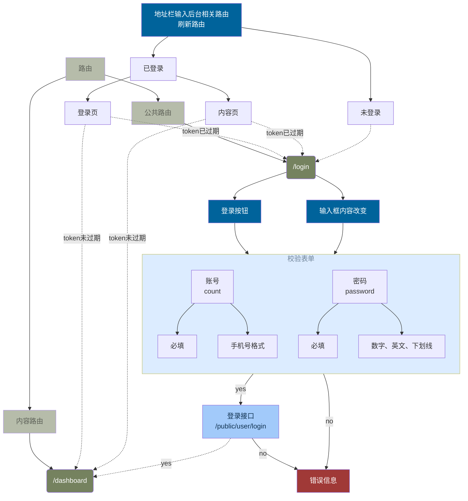

```mermaid
flowchart TB
	classDef page fill:#75825F,color:#FFF
	classDef catalog fill:#98A187,color:#000,opacity:0.7
	classDef operate fill:#00639B,color:#FFF
	classDef asyncOperate fill:#CEE5FF,color:#001D33,opacity:0.7
	classDef api fill:#A2CAFA,color:#113250
	classDef toast_error fill:#A03937,color:#FFF

  %% 路由列表
	Routes["路由"]:::catalog --> publicRoutes["公共路由"] & contentRoutes["内容路由"]
	publicRoutes:::catalog --> login
	contentRoutes:::catalog --> dashboard

  %% 登录流程图

  Operate1_1["地址栏输入后台相关路由\n刷新路由"]:::operate --> Status1_1["已登录"] & Status1_2["未登录"]
		Status1_1 --> Target1_1["登录页"] & Target1_2["内容页"]
			Target1_1 -.-> |token已过期| login("/login"):::page
			Target1_1 -.-> |token未过期| dashboard("/dashboard"):::page
			Target1_2 -.-> |token已过期| login
			Target1_2 -.-> |token未过期| dashboard
		Status1_2 -.-> login


	login --> Operate2_1["登录按钮"] & Operate2_2["输入框内容改变"]
		subgraph ValidLoginForm["校验表单"]
		direction TB
			form2_1["账号\ncount"] & form2_2["密码\npassword"]
				form2_1 --> valid2_1_1["必填"] & valid2_1_2["手机号格式"]
				form2_2 --> valid2_2_1["必填"] & valid2_2_2["数字、英文、下划线"]
		end
		Operate2_1:::operate -->ValidLoginForm
		Operate2_2:::operate -->ValidLoginForm
		ValidLoginForm:::asyncOperate --> |yes| Api2_1["登录接口\n /public/user/login"]:::api
		ValidLoginForm --> |no| Toast2_1["错误信息"]:::toast_error
		Api2_1 -.-> |yes| dashboard
		Api2_1 --> |no| Toast2_1
```