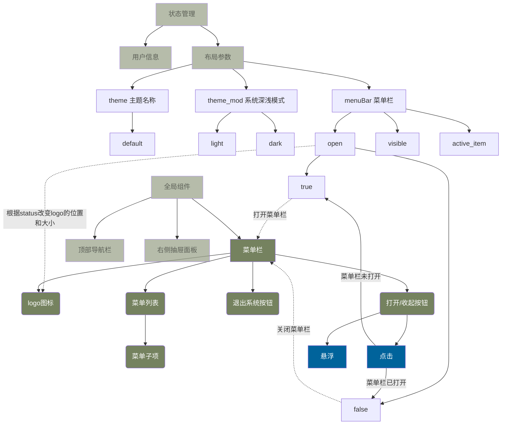

```mermaid
flowchart TB
  classDef element fill:#75825F,color:#FFF
	classDef catalog fill:#98A187,color:#000,opacity:0.7
  classDef operate fill:#00639B,color:#FFF

  %% 状态管理数据结构
  State["状态管理"]:::catalog --> stateUser["用户信息"]:::catalog
  State["状态管理"] --> stateLayout["布局参数"]:::catalog


  stateLayout --> stateLayout_theme["theme 主题名称"]
    stateLayout_theme --> stateLayout_theme_defalut["default"]

  stateLayout --> stateLayout_themeMod["theme_mod 系统深浅模式"]
    stateLayout_themeMod--> stateLayout_themeMod_light["light"] & stateLayout_themeMod_dark["dark"]

  stateLayout --> stateLayout_menuBar["menuBar 菜单栏"]
    stateLayout_menuBar --> stateLayout_menuBar_open["open"]
      stateLayout_menuBar_open --> stateLayout_menuBar_open_status_1["true"] & stateLayout_menuBar_open_status_2["false"]
        stateLayout_menuBar_open_status_1 -.-> |"打开菜单栏"| component_menuBar
        stateLayout_menuBar_open_status_2 -.-> |"关闭菜单栏"| component_menuBar

        stateLayout_menuBar_open -.-> |"根据status改变logo的位置和大小"| component_menuBar_logo

    stateLayout_menuBar -->stateLayout_menuBar_visible["visible"]
    stateLayout_menuBar --> stateLayout_menuBar_["active_item"]

  %% 组件
  Component["全局组件"]:::catalog --> component_menuBar["菜单栏"]:::element
  Component["全局组件"] --> component_navBar["顶部导航栏"]:::catalog
  Component["全局组件"] --> component_rightPanel["右侧抽屉面板"]:::catalog

  %% 菜单栏
  component_menuBar --> component_menuBar_logo("logo图标"):::element
  component_menuBar --> component_menuBar_toggle("打开/收起按钮"):::element
  component_menuBar --> component_menuBar_logout("退出系统按钮"):::element
  component_menuBar --> component_menuBar_menuList("菜单列表"):::element
    component_menuBar_menuList --> component_menuBar_menuItem("菜单子项"):::element
  
  component_menuBar_toggle --> operate_menuBar_1["点击"] & operate_menuBar_2["悬浮"]
    operate_menuBar_1:::operate --> |"菜单栏未打开"| stateLayout_menuBar_open_status_1
    operate_menuBar_1:::operate --> |"菜单栏已打开"| stateLayout_menuBar_open_status_2
    
    operate_menuBar_2:::operate

```